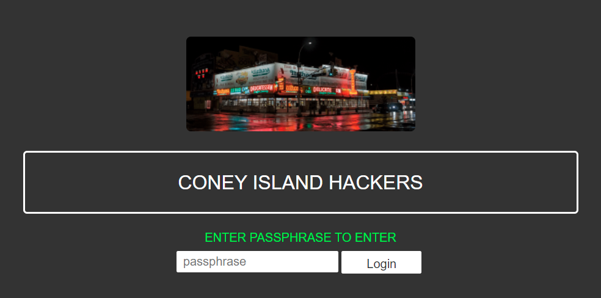

# Coney Island Hackers

> Coney Island Hackers have a secret web portal.
> 
> Using advanced social engineering techniques, you found out their secret passphrase: `eat,sleep,hack,repeat`. However, it seems to take more than just entering the passphrase as-is. Can you find out what?
> 
> http://46.101.107.117:2202

Page has a single form:

So we enter the password: `eat,sleep,hack,repeat`. We then get taken to an
error page saying "comma found". We also notice that the form uses GET, which
makes the form parameters visible in the URL. Easy to tamper with:

`http://46.101.107.117:2202/?passphrase=eat%2Csleep%2Chack%2Crepeat&form=`

So perhaps this password is meant to be entered as four separate values? What
if we instead modify the URL to provide the passphrase parameter four times:

`http://46.101.107.117:2202/?passphrase=eat&passphrase=sleep&passphrase=hack&passphrase=repeat&form=`

Nope, gives us another error "passphrase param found more than once". Another
common way to pass the same parameter multiple times is using "name[]" syntax:

`http://46.101.107.117:2202/?passphrase[]=eat&passphrase[]=sleep&passphrase[]=hack&passphrase[]=repeat&form=`

That worked, we got a flag: `he2022{el_dorado_arkade}`
